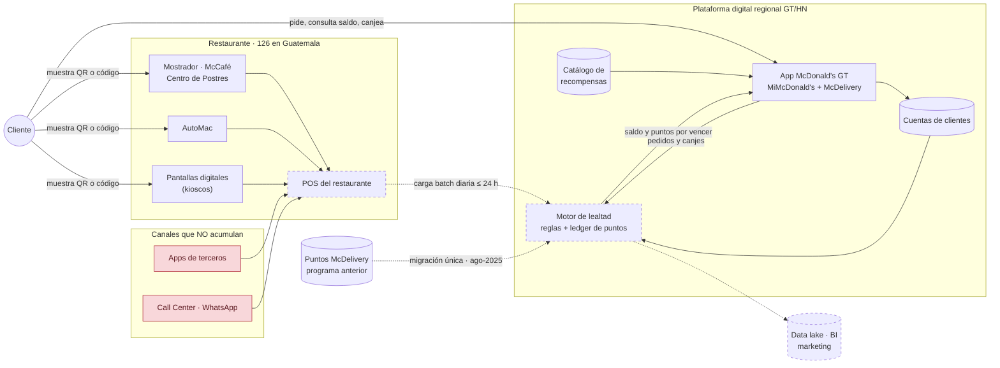
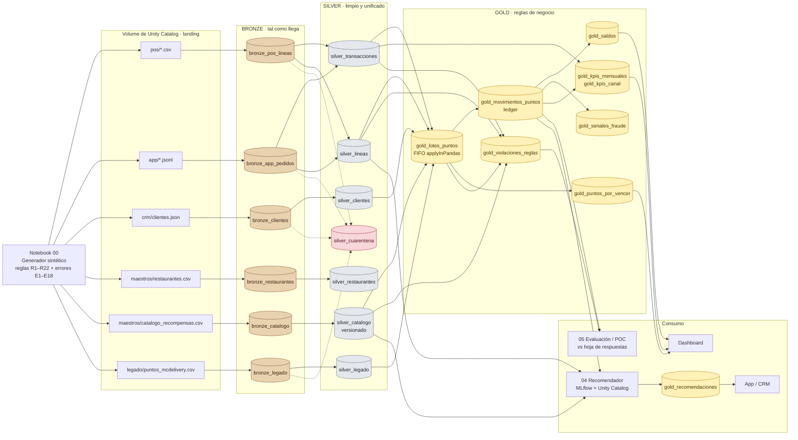

# Arquitectura de datos — MiMcDonald's Guatemala

Hay dos diagramas:

1. **Arquitectura actual (inferida):** cómo creemos que funciona hoy el sistema, a partir de la
   documentación pública (Fase 1).
2. **Réplica en miniatura:** la arquitectura medallion que construimos en Databricks Free
   Edition para reproducirla.

Convención: **borde sólido = documentado**, **borde punteado = inferido o supuesto**.

---

## 1. Arquitectura actual (inferida)

**Cómo leerlo:**

- **Dos rutas de entrada.** Las compras en el restaurante pasan por el **POS** y llegan al
  motor de lealtad en lotes: por eso los puntos tardan hasta 24 horas (R9). Las compras en la
  **app** ya conocen al cliente y entran directo.
- **El POS no conoce al cliente.** Solo recibe el código QR, y la identidad se resuelve en el
  centro. Si el cliente no muestra el código, la compra no acumula y no hay forma de
  recuperarla.
- **Los canales excluidos sí pasan por el POS** (el restaurante prepara el pedido), así que el
  motor tiene que filtrarlos por canal (R7).
- **El motor de lealtad es la pieza crítica y la menos documentada.** Guarda cada movimiento
  (ledger), aplica topes y vencimientos, y le devuelve a la app el saldo y los puntos por
  vencer.

---

## 2. Réplica en miniatura — medallion en Databricks

**Qué hace cada capa y por qué:**

| Capa | Qué contiene | Decisión | Por qué |
|---|---|---|---|
| **Landing** (Volume) | Los archivos tal como los "envían" los sistemas | Separar archivos de tablas | Se puede reprocesar desde cero y se simula que los datos *llegan*, no que ya están en una tabla |
| **Bronze** | Una tabla por fuente, sin transformar, + `_archivo_origen` y `_fecha_ingesta` | No se limpia nada | Auditoría: si un saldo no cuadra, aquí está el dato original |
| **Silver** | Entidades limpias con un solo formato: horas en `America/Guatemala`, llaves unificadas, POS y app en la **misma** tabla de transacciones | Unificar las dos rutas de entrada | Las reglas de puntos deben aplicarse igual sin importar el canal |
| **Silver · cuarentena** | Registros rechazados + motivo | No borrar en silencio | Un consultor debe poder decir *cuántos* datos se perdieron y *por qué* |
| **Gold** | El **ledger** de puntos y lo que se calcula a partir de él | Las reglas de negocio (R1–R22) viven aquí | Silver describe *qué pasó*; Gold aplica *qué significa* para el programa |

**Relación con la arquitectura actual:** el POS y la app son las fuentes A y B; el motor de
lealtad se convierte en `gold_movimientos_puntos`; el data lake es el medallion completo. El
patrón es el mismo en cualquier nube: en Google Cloud sería Cloud Storage + BigQuery, y aquí
es Volume + tablas Delta.
