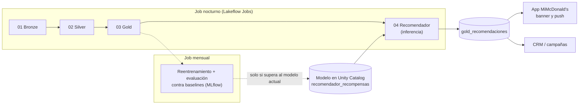

# Fase 4 — Modelado (CRISP-DM): recomendador de recompensas

**Entregable del caso:** *"Propuesta para integrar un modelo de ML, AI o LLM en el pipeline de
datos"*. Este documento es la propuesta; [notebooks/04_recomendador.py](../notebooks/04_recomendador.py)
es el prototipo que demuestra que funciona.

---

## 1. El problema de negocio

**¿Qué recompensa le mostramos a cada cliente en la app para que vuelva y canjee?**

Hoy la app muestra el mismo catálogo a todos. Un recomendador personaliza ese espacio, igual
que McDonald's corporativo hace con Dynamic Yield en menús y ofertas. Además, el mensaje usa el
saldo real del ledger: "te faltan 500 puntos para tu McFlurry" invita a volver, cosa que un
catálogo genérico no hace.

## 2. Primero: ¿hay algo que aprender?

Antes de diseñar el modelo se verificó si los datos tenían **señal**. Con los datos originales
(v1) se compararon tres estrategias para predecir qué productos compraría cada cliente:

| Estrategia (v1) | Hit@3 |
|---|---|
| Lo más popular para todos | 0.659 |
| Lo que el cliente más compra | 0.664 |
| Filtrado colaborativo (item-kNN) | 0.641 |

**Personalizar no superaba a la popularidad.** La razón: en el generador v1 todos los clientes
elegían los productos con la misma distribución. Ningún modelo puede aprender gustos que no
existen.

**Decisión:** crear el **generador v2**, donde cada cliente tiene un **perfil de gustos** oculto
(res, pollo, desayuno, café y postres, familia) que sesga lo que compra **y** lo que canjea.
Se documenta como supuesto: los clientes reales tienen gustos; la v1 no los modelaba.

> **Lección:** siempre medir contra un baseline simple. Sin esta comparación habríamos
> presentado un modelo con hit@3 = 0.64 que parece bueno pero no aporta nada.

## 3. Diseño del modelo

### Dos etapas, como los recomendadores reales

1. **Candidatos:** las recompensas vigentes en el catálogo ese día (SCD2 de Silver).
2. **Ranking:** un clasificador estima, para cada par (cliente, recompensa), la probabilidad de
   que la canjee en los próximos 92 días; se ordena por esa probabilidad.

¿Por qué no un filtrado colaborativo puro? Porque un canje no depende solo del gusto: depende de
**cuántos puntos tiene** el cliente y de **la hora** (los desayunos solo se canjean temprano).
El ranking combina todo.

### Variables (una sola función para entrenamiento, prueba y producción)

| Variable | Fuente | Idea |
|---|---|---|
| `share_producto`, `share_categoria` | `silver_lineas` | Gusto específico y amplio |
| `canjes_previos` | `silver_lineas` | Hábito |
| `popularidad` | `silver_lineas` (180 días) | Lo que funciona en general |
| `costo`, `saldo`, `alcanza` | `silver_catalogo`, `gold_movimientos_puntos` | Factibilidad: el saldo **al corte** sale del ledger |
| `puntos_mes` | `silver_lineas` (90 días) | Qué tan pronto le alcanzará |
| `pct_desayuno`, `es_desayuno`, `afinidad_desayuno` | `silver_transacciones` | Restricción de horario |

Usar la misma función en todos los casos evita el *training-serving skew*: que el modelo vea en
producción variables calculadas distinto a como las aprendió.

### Validación temporal y fuga de información

| Conjunto | Variables hasta | Etiqueta (canjes entre) |
|---|---|---|
| Entrenamiento | 20-mar-2026 | 20-mar → 20-jun |
| Prueba | 20-jun-2026 | 20-jun → 20-sep |
| Producción | 20-sep-2026 | — |

Dos trampas que se evitaron:

1. **Variables con datos del futuro** (la misma lección de `score` y `winner` en el Ejercicio 1).
   Cada variable filtra `fecha < corte`, incluido el saldo.
2. **Recompensas que desaparecen.** El café salió del catálogo el 30-jun: evaluar con él castiga
   al modelo por no acertar algo que ya no existía. Se evalúa solo con recompensas vigentes durante
   **toda** la ventana. Como saber que algo va a salir es información del futuro, ese filtro solo
   se aplica a la **etiqueta**, nunca a las variables.

## 4. Resultados (datos v2, periodo de prueba)

| Estrategia | Hit@1 | Hit@3 |
|---|---|---|
| Baseline: popularidad | 0.356 | 0.809 |
| Baseline: frecuencia personal | 0.229 | 0.558 |
| Regresión logística | 0.400 | 0.818 |
| **Gradient boosting** | **0.495** | **0.879** |

El gradient boosting acierta la recompensa del banner principal (hit@1) **39 % más** que
recomendar lo más popular.

### ¿Qué aprendió? (importancia por permutación)

| Variable | Caída de hit@1 al desordenarla |
|---|---|
| `costo` | 0.199 |
| `share_categoria` | 0.061 |
| `alcanza` | 0.051 |
| `popularidad` | 0.038 |
| `canjes_previos` | 0.036 |
| `saldo` | 0.020 |
| Variables de desayuno, `share_producto`, `puntos_mes` | ≈ 0 |

**Lo que más predice un canje es que la recompensa sea barata**, y luego el gusto por la
categoría. Por eso el top 1 en producción es casi siempre papas medianas o nuggets (3,000
puntos), personalizados según el gusto: a los de pollo les salen nuggets y a los de res, la
quesoburguesa.

> **Decisión de negocio que se le devuelve al cliente:** el modelo optimiza *probabilidad de
> canje*, y eso empuja lo barato. Si el objetivo fuera otro (más visitas, mayor ticket o usar
> puntos antes de que venzan), la etiqueta del modelo debe cambiar. **Qué optimiza un modelo es
> una decisión de negocio, no técnica.**

## 5. Integración en el pipeline

| Aspecto | Propuesta |
|---|---|
| **Frecuencia de inferencia** | Nocturna, después de Gold: las recomendaciones usan el saldo del día |
| **Frecuencia de reentrenamiento** | Mensual, o cuando cambie el catálogo (una recompensa nueva no tiene historia) |
| **Promoción de modelos** | El modelo nuevo se registra en Unity Catalog y solo reemplaza al actual si supera su hit@1 **y** el de los baselines en la ventana más reciente |
| **Monitoreo** | hit@1 semanal con los canjes reales; tasa de clic del banner; distribución de recompensas recomendadas (alerta si una sola acapara el top 1) |
| **Arranque en frío** | Clientes con menos de 3 productos comprados reciben el baseline de popularidad |
| **Validación real** | Prueba A/B: 50 % ve el catálogo actual y 50 % el recomendado; se mide canjes y visitas en 30 días |

## 6. Limitaciones

- **Datos sintéticos:** la mejora medida depende de los gustos que se simularon. Con datos
  reales la magnitud puede ser otra; por eso la prueba A/B es obligatoria antes de escalar.
- **Objetivo:** el modelo favorece lo barato (ver sección 4).
- **Catálogo:** solo 10 recompensas. Con un catálogo más grande el valor de personalizar crece.
- **Escala:** el entrenamiento usa pandas y scikit-learn en el *driver*, suficiente para miles de
  clientes. Para los millones de McDonald's se usaría Spark ML o entrenamiento distribuido.

## 7. Extensión propuesta: un LLM para el mensaje

El prototipo usa una plantilla ("Te faltan 500 puntos para tu McFlurry"). Un LLM podría redactar
el mensaje con el contexto del cliente (su recompensa, sus puntos por vencer, su horario). En
Databricks se haría con `ai_query()` sobre `gold_recomendaciones`, con dos controles: el LLM
**no decide** qué recompensa ofrecer (eso lo hace el modelo, que es medible) y los mensajes se
revisan contra reglas de marca antes de enviarse.
